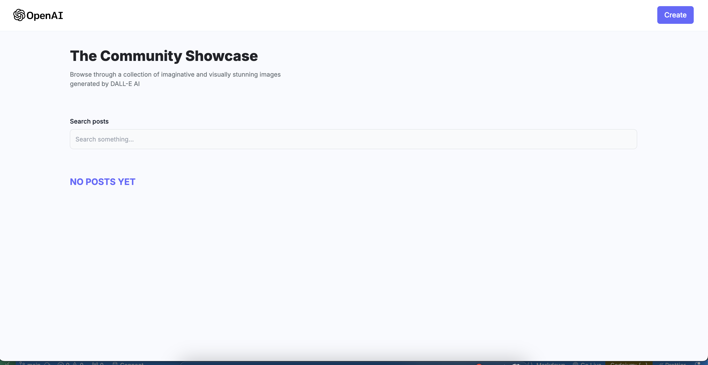
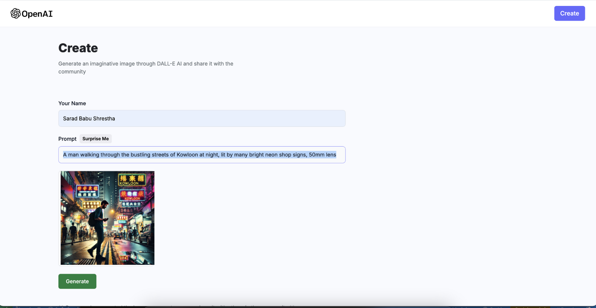

# AI Image Generation App - MidJourney & DALL-E Clone

A full-stack MERN app for generating AI images inspired by MidJourney and DALL-E. Users can create images from prompts, save them, and view other users' creations.

## Features

- **Text-to-Image**: Generate images from text prompts.
- **Image Gallery**: Explore creations from other users.
- **Real-Time Status**: Updates on image generation progress.

## Tech Stack

- **Frontend**: React, TailwindCSS
- **Backend**: Node.js, Express, MongoDB
- **Image Generation**: OpenAI API (or custom AI model)
- **Image Hosting**: Cloudinary

